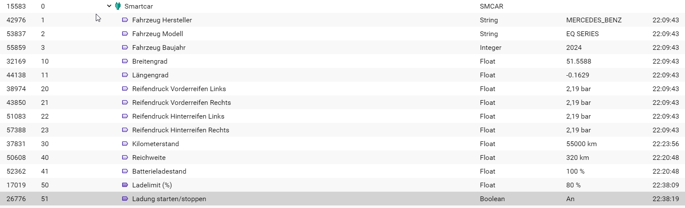

# Modul für Smartcar für IP-Symcon
Dieses Modul ermöglicht, Daten von Fahrzeugen über die Smartcar-Plattform abzufragen. 
Erstelle ein Profil und verbinde dein Fahrezug oder ein Testfahrzeug (https://smartcar.com/de)
Smartcar unterstützt aktuell 43 Fahrzeugmarken. Prüfe hier welche Endpunkte dein Fahrezug unterstützt. (https://smartcar.com/de/product/compatible-vehicles)
In der aktuellen Version dieses Moduls ist ein Fahrzeug unterstützt.
In der kostenlosen Version von Smartcar kann sowieso nur ein Live-Fahrezug pro Benutzerprofil angelegt werden.
Für mehrere Fahrezuge ist das Modul mehrmals anzulegen.

### Wichtig zu wissen zur Konfiguration von Smartcar
Das Modul verbindet sich über OAuth 2.0 mit der Smartcar API. 
Daher ist es erforderlich, eine Redirect URI in der Smartcar-Konfiguration einzutragen. 
Die Redirect URI ist der Pfad zum Webhook, welchen das Modul automatisch anlegt. 
Dieser Pfad setzt sich aus deiner Connenct-Adresse und dem Pfad des Webhook zusammen. 
Der Pfad der Redirect-URI wird oben im Konfigurationsformular angezeigt. 
Diesen hinterlegst du dann in der Konfiguration von Smartcar unter 'REDIRECT URIS' Dies sieht zB so aus: https://hruw8ehwWERUOwehrWWoiuh.ipmagic.de/hook/smartcar_15583
Wenn du im Konfigurationsformular die Berchtigungen gewählt oder geändert hast, ist dies erneut über den Button 'Verbindung starten' als URL auszugeben und im Browser bei Smartcar zu registrieren.

Aktuell sind folgende Scopes (Endpunkte) durch das Modul unterstützt:
* "Fahrzeuginformationen lesen (/)"
* "VIN lesen (/vin)"
* "Standort lesen (/location)"
* "Reifendruck lesen (/tires/pressure)"
* "Kilometerstand lesen (/odometer)"
* "Batteriestlevel lesen (/battery)"
* "Batterieststatus lesen (/battery/capacity)"
* "Motoröl lesen (/oil)"
* "Kraftstoffstand lesen (/fuel)"
* "Sicherheitsstatus lesen (/security)"
* "Ladelimit lesen (/charge/limit)"
* "Ladestatus lesen (/charge)"

Aktuell sind folgende Ansteuerungen unterstützt
* "Ladelimit setzen (/charge/limit)"
* "Ladestatus setzen (/charge)"
* "Zentralverriegelung setzen (/security)"

### Inhaltsverzeichnis

1. [Funktionsumfang](#1-funktionsumfang)
2. [Voraussetzungen](#2-voraussetzungen)
3. [Software-Installation](#3-software-installation)
4. [Einrichten der Instanzen in IP-Symcon](#4-einrichten-der-instanzen-in-ip-symcon)
5. [Statusvariablen und Profile](#5-statusvariablen-und-profile)
6. [WebFront](#6-webfront)
7. [PHP-Befehlsreferenz](#7-php-befehlsreferenz)
8. [Versionen](#8-versionen)

### 1. Funktionsumfang

* Abfrage der ausgewählterFahrzeugdaten und ausführen verschiedener Ansteuerung am Fahrzeug.
* Die kostenlose Version unterstützt ein Fahrzeug mit 500 API-Calls pro Monat.
* Es gibt eine Bezahlversion für 2.99$ mit 1000 API-Calls pro Monat
* Die Testfahrzeuge der Smartcar-Plattform sind unterstützt. Zum testen sollten diese Verwendet werden, um den API-Verbrauch des Live-Fahrzeuges zu schonen.
* Vorsicht: Frag nur Endpunkte ab, die du wirklich brauchst, sonst ist das Guthaben schnell aufgebraucht. Lies dazu weiter unten die [PHP-Befehlsreferenz](#7-php-befehlsreferenz)

### 2. Voraussetzungen

- IP-Symcon ab Version 7.0
- Smartcar Profil mit einem Test-Fahrzeug oder einem Live-Fahrezug.

### 3. Software-Installation

* Über den Module Store kann das Modul noch nicht installiert werden da noch beta. Es muss im Store nach dem genauen Modulnamen gesucht werden.

### 4. Einrichten der Instanzen in IP-Symcon

- Unter 'Instanz hinzufügen' kann das 'Smartcar'-Modul mithilfe des Schnellfilters gefunden werden.  
- Weitere Informationen zum Hinzufügen von Instanzen in der [Dokumentation der Instanzen](https://www.symcon.de/service/dokumentation/konzepte/instanzen/#Instanz_hinzufügen)

__Konfigurationsseite__:

Name     | Beschreibung
-------- | ------------------
Redirect-URI                |  Das ist der Pfad zum Webhook. Dieser Pfad gehört in die Konfiguration von Smartcar unter REDIRECT URIS.
Client ID                   |  Entnimm diesen in der Konfiguration von Smartcar unter OAuth
Client Secret               |  Entnimm diesen in der Konfiguration von Smartcar unter OAuth
Verbindungsmodus            |  Hier definierst du, ob es sich um ein Simmuliertes oder ein Live-Fahrzeug handelt. Die Fahrzeuge verwaltest du im Dashboard von Smartcar. Es kann auch zwischen simmulierem und Live-Fahrezug gewechstelt werden, jedoch muss danach 'Smartcar verbinden' erneut gewählt werden.
Berchtigungen (Scopes)      |  Hier sind die aktuell vom Modul unterstützen Scopes zur Auswahl. Wichtig ist, dass alle angewählt werden, die später abgefragt werden, sonst werden hier keine Werte geliefert. Im Zweifelsfalle vor der Abfrage alle aktivieren. Die Variablen werden automatisch erstellt und beim Deaktivieren wieder gelöscht. Die Berechtigungen bleiben aber.
Smartcar verbinden         |  Es öffnet siche ein Browserfenster, wo du dich mit deinen Zugangsdaten vom Fahrzeughersteller anmeldest und die gewählten Berechtigungen bei Smartcar noch genemigst. Am Anschluss erscheint eine Erfolgsmeldung und die Zugriff-Token werden über die Redirect-URI an das Modul übertragen.
Fahrzeugdaten abrufen       |  Hier rufst du alle aktivierten Scopes ab. Sei vorsichtig bei einem Live-Fahrzeug. Fünf aktivierte Scopes ergeben 5 API-Calls. Lies hier [PHP-Befehlsreferenz](#7-php-befehlsreferenz) wie du exclusiv die gewünnschten Variablen aktualisierst.

### 5. Statusvariablen und Profile

Die Statusvariablen/Kategorien werden automatisch angelegt. Das Löschen einzelner kann zu Fehlfunktionen führen.

#### Statusvariablen

Es werden Variablen/Typen je nach Wahl der Scopes erstellt. Es können pro Scope mehrere Variablen erstellt werden. Beim Deaktivieren des jeweiligen Scope werden die Variablen wieder gelöscht.

#### Profile

Name   | Typ
------ | ------- 
SMCAR.Odometer   |  Float  
SMCAR.Pressure   |  Float   
SMCAR.Progress   |  Float  
SMCAR.Status     |  String   
SMCAR.Charge     |  String

### 6. WebFront

Die Variablen zur Steuerung der Fahrzeugfunktion können aus der Visualisierung heraus gesteuert werden.

### 7. PHP-Befehlsreferenz

Hier findest du die Info, wie geziehlt (zb über einen Ablaufplan) nur bestimmte Endpunkte (Scopes) abgefragt werden, um API-Calls zu sparen. 
Ein Scenario wäre, dass der SOC nur bei aktiviertem Ladevorgang alle 15min über einen Ablaufplan aktualisiert wird.
Beachte, dass nur im Konfigurationsformuler (Berechtigungen) freigegebene Scopes abgefragt werden können.

Befehl   | Beschreibung
------ | -------
WPLUX_FetchBatteryCapacity(12345);  |   Abfrage der Batteriekapazität
WPLUX_FetchBatteryLevel(12345);     |   Abfrage des Batterieladestand (SOC)
WPLUX_FetchChargeLimit(12345);      |   Abfrage des Ladelimits
WPLUX_FetchChargeStatus(12345);     |   Abfrage des Ladestatus
WPLUX_FetchEngineOil(12345);        |   Abfrage der restliche Oellebensdauer
WPLUX_FetchFuel(12345);             |   Abfrage des Tankvolumens    
WPLUX_FetchLocation(12345);         |   Abfragen der GPS-Koordinaten
WPLUX_FetchOdometer(12345);         |   Abfragen des Kilomterstandes
WPLUX_FetchCSecurity(12345);        |   Abfrage des Verriegelungsstatus der Türen, Klappen und Fenster
WPLUX_FetchTires(12345);            |   Abfrage des Reifendruckes
WPLUX_FetchVIN(12345);              |   Abfrage der Fahrgestellnummer
WPLUX_FetchVehicleData(12345);      |   Alle im Modul aktiverten Scopes abfragen. Vorsicht, es könnten sehr viele API-Calls verbraucht werden

### 8. Versionen

Version 1.0 (04.02.2024)

- Initiale Version