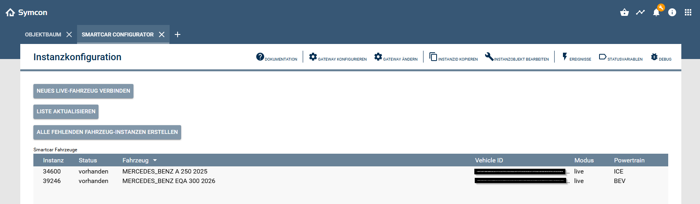

# 🚗 Smartcar Modul für IP-Symcon (Configurator Instanz)

## 1. Funktionsumfang

- Anzeige aller verbundenen Smartcar-Fahrzeuge.  
- Erstellung von Fahrzeug-Instanzen in IP-Symcon.  
- Auswahl und Konfiguration der gewünschten Signale.  
- Übersicht über kompatible Fahrzeuge und deren Fähigkeiten.  
- Vereinfachte Einrichtung neuer Fahrzeuge.  

---

## 2. Voraussetzungen

- IP-Symcon ab Version **8.2**  
- Eingerichtetes Smartcar Splitter Modul  
- Erfolgreich verbundene Smartcar-Session  

---

## 3. Installation

Das Modul wird automatisch zusammen mit dem Smartcar-Modul installiert.

---

## 4. Einrichten der Instanz

Der Konfigurator benötigt keine klassische Konfiguration.  
Die Oberfläche stellt automatisch alle verfügbaren Fahrzeuge und Aktionen bereit.

| Aktion | Beschreibung |
|--------|--------------|
| **Neues Live-Fahrzeug verbinden** | Hiermit wird der Connect Prozess gestartet, um ein noch nicht vorhandenes Fahrezug zur Smartcar-Konfiguration hinzuzufügen |
| **Liste aktualisieren** | Hiermit kann die Fahrezugliste aktualisiert werden, ohne ds Konfigurationsformular neu zu starten, zum Beispiel nach dem Hinzufügen eines neuen Fahrzeuges |
| **Alle fehlenden Fahrezug-Instanzen verbinden** | Hiermit werden für alle in der Smartcar-Konfiguration vorhandenen Fahrezuge die entsprechenden Fahrzeug-Instanzen angelegt |
| **Smartcar-Fahrzeuge** | Hier werden alle in der Smartcar-Konfiguratieon vorhandenen Fahrzeuge gelistet|

---

## 5. Verwendung

Der Konfigurator zeigt:

- Alle verfügbaren Fahrzeuge aus deinem Smartcar-Account  
- Fahrzeugdetails wie Marke, Modell und Baujahr  
- Möglichkeit zur Erstellung einer neuen Fahrzeug-Instanz  

---

## 6. Fahrzeug hinzufügen

1. Konfigurator öffnen  
2. Fahrzeug auswählen  
3. Instanz erstellen  
4. Signale im Fahrzeugmodul auswählen  

---

## 6. Kompatibilität

- Die verfügbaren Signale werden automatisch anhand des Fahrzeugs gefiltert.  
- Nicht unterstützte Funktionen werden ausgeblendet.  

---

## 7. Hinweise

- Der Konfigurator dient ausschließlich zur Einrichtung.  
- Die eigentliche Datenverarbeitung erfolgt im Fahrzeugmodul.  

---

## 8. Lizenz

Dieses Modul steht unter der **MIT-Lizenz**.  
© 2025 Stefan Künzli  
https://opensource.org/licenses/MIT