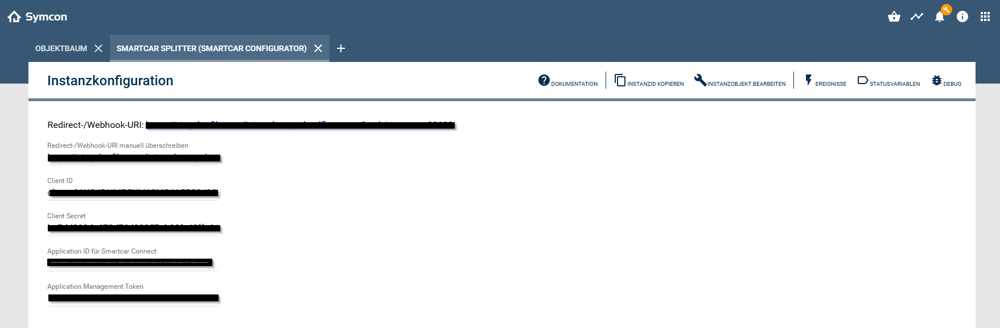

# 🚗 Smartcar Modul für IP-Symcon (Splitter Instanz)

## 1. Funktionsumfang

- Zentrale Kommunikation mit der Smartcar API (OAuth2, Tokenverwaltung).  
- Verwaltung der Verbindung zwischen IP-Symcon und Smartcar.  
- Automatische Aktualisierung und Erneuerung von Access Tokens.  
- Bereitstellung der Daten für untergeordnete Fahrzeug-Instanzen.  
- Empfang und Verarbeitung von Smartcar Webhooks (Push).  
- Weiterleitung der empfangenen Signale an die jeweiligen Fahrzeug-Instanzen.  
- Fehler- und Debug-Ausgaben im Symcon-Debug-Fenster.  

---

## 2. Voraussetzungen

- IP-Symcon ab Version **8.2**  
- Smartcar Developer Account  
- Smartcar Application (Client ID & Secret)

---

## 3. Installation

Das Modul wird automatisch zusammen mit dem Smartcar-Modul installiert.

---

## 4. Einrichten der Instanz

| Feld / Aktion | Beschreibung |
|------|---------------|
| **Redirect URI** | Wird vom Modul angezeigt und muss in der Smartcar Application hinterlegt werden (OAuth Redirect URI). |
| **Manuelle Redirect URI** | Optional. Nur verwenden, wenn nicht automatisch die Symcon-Connect-URL genutzt werden soll. |
| **Client ID** | Client ID aus der Smartcar Application. |
| **Client Secret** | Client Secret aus der Smartcar Application. |
| **Application ID** | ID der Smartcar Application. |
| **Application Management Token** | Management-Token der Smartcar Application (z. B. für Webhook-Verifizierung). |

---

## 5. Authentifizierung

Die Verbindung erfolgt über OAuth2:

1. Klick auf **„Mit Smartcar verbinden“**  
2. Login beim Fahrzeughersteller  
3. Bestätigung der Berechtigungen  
4. Rückleitung zu IP-Symcon  

Access- und Refresh-Tokens werden automatisch verwaltet und regelmäßig erneuert.

---

## 6. Webhooks (Push)

- Smartcar sendet Ereignisse an den Webhook des Splitters.  
- Der Splitter validiert und verarbeitet die eingehenden Daten.  
- Anschließend werden die Signale an die entsprechenden Fahrzeug-Instanzen weitergeleitet.  

> Hinweis: Die Webhook-URL wird automatisch durch das Modul generiert und muss in der Smartcar Application hinterlegt werden.

---

## 7. Datenverarbeitung

- Die Kommunikation erfolgt über interne IPS-Nachrichten (DataID).  
- Der Splitter fungiert als zentrale Schnittstelle zwischen Smartcar API und Fahrzeugmodulen.  

---

## 8. Debugging

Alle API-Anfragen, Token-Vorgänge und Webhook-Daten können im Debug-Fenster analysiert werden.

---

## 9. Lizenz

Dieses Modul steht unter der **MIT-Lizenz**.  
© 2025 Stefan Künzli  
https://opensource.org/licenses/MIT