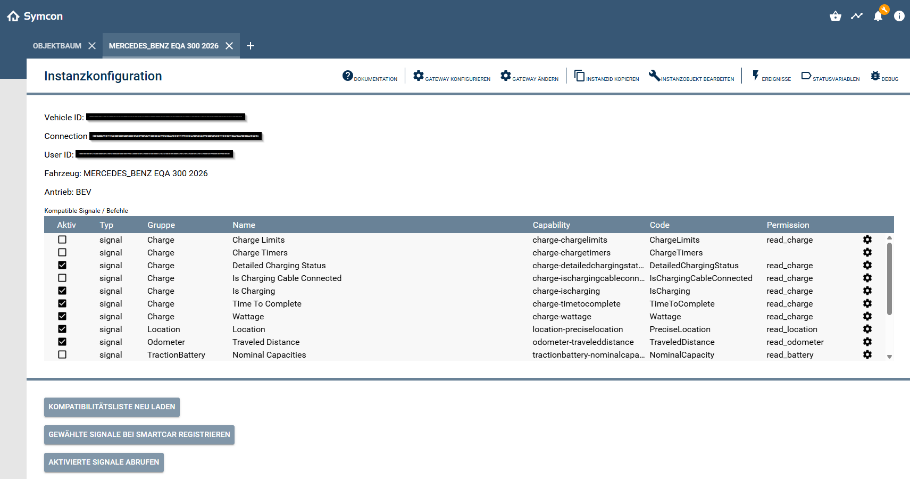

# 🚗 Smartcar Modul für IP-Symcon (Vehicle Instanz)

## 1. Funktionsumfang

- Verbindung eines Fahrzeugs über Smartcar (Test-Fahrzeuge sind nicht unterstützt).  
- Automatische Ermittlung der kompatiblen Signale und Befehle pro Fahrzeug.  
- Auswahl der gewünschten Signale und Befehle über Checkbox-Liste.  
- Manuelle oder externe Abfrage aktivierter Signale über die Smartcar API (Pull).  
- Unterstützung von **Smartcar Signals (Webhooks)** zur automatischen Aktualisierung direkt vom OEM-Backend (Push).  
- Steuerung von Funktionen wie Zentralverriegelung, Ladevorgang oder Ladelimit.  
- Automatische Erstellung und Verwaltung der Statusvariablen.  
- Fehler- und Debug-Ausgaben im Symcon-Debug-Fenster.   

---

## 2. Voraussetzungen

- IP-Symcon ab Version **8.2**  
- Smartcar-Konto  
- Mit Smartcar kompatibles Fahrzeug welches mit dem OEM-Portal verbunden ist

---

## 3. Installation

Das Modul kann direkt über den **Symcon Module Store** installiert werden.

---

## 4. Einrichten der Instanz

Unter *Instanz hinzufügen* das Modul **Smartcar** auswählen.

| Feld | Beschreibung |
|------|---------------|
| **Kompatible Signale / Befehle** | Diese Liste wird automatisch beim Installieren der Fahrezuginstanz asu dem Konfigurator geladen. Sie kann auch über den Button 'Kompatibilitätsliste neu laden' neu abgefragt werden. Die Liste wird 24h durch das Modul gecacht. |
| **Kompatibilität neu laden** | Damit kann die Kompatibilitätsliste neu geladen werden. Die Liste wird 24h durch das Modul gecacht. |
| **Gewählte Signale bei Smartcar registrieren** | Damit können die aus der Kompatibilitätsliste ausgewählten Signale bei Smartcar registriert werden, ansonsten die Signale nicht einwandfrei bzw. gar nicht empfangen werden können. |
| **Aktivierte Signale abrufen** | Damit lassen sich alle aktivierten Signale auf einmal abrufen. |

---

## 5. Smartcar Signals

Es gibt diverse Möglichkeiten, die Signale zu aktualisieren.
1. Durch akualieren über den entsprechenden Button 'AKtivierte Signale abrufen' im Konfigurationsformular (Pull).  
2. Durch akualisieren aller oder einzelner Signale über ein Script (Pull)
3. Durch empfangen der Signale über den Webhook, sobald diese beim OEM aktualisiert wurden (Push).

### Signalgruppen und Befehle (Beispiele)

| Kategorie | Signaltyp / Befehlstyp | Beispiel-Signale / Befehle | Beschreibung |
|------------|------------------------|-----------------------------|---------------|
| **Batterie & Laden** | `tractionbattery-*`, `charge-*` | `tractionbattery-stateofcharge`, `charge-ischarging`, `charge-chargelimits` | SOC, Ladezustand, Ladelimit |
| **Ladebefehle** | `charge-*` Commands | `charge-start`, `charge-stop`, `charge-set-limit` | Ladevorgang starten/stoppen, Ladelimit setzen |
| **Sicherheit & Türen** | `closure-*`, `security-*` | `closure-islocked`, `closure-doors`, `closure-windows` | Verriegelungsstatus, offene Türen/Fenster |
| **Türbefehle** | `security-*` Commands | `security-lock`, `security-unlock` | Fahrzeug verriegeln/entriegeln |
| **Fahrzeugbewegung** | `location-*`, `odometer-*` | `location-preciselocation`, `odometer-traveleddistance` | GPS, Kilometerstand |
| **Fahrzeuginfo** | `vehicleidentification-*`, `internalcombustionengine-*` | `vehicleidentification-*`, `internalcombustionengine-fuellevel` | Stammdaten & Motorstatus |
| **Reifendruck** | `tires-*` | `tires-pressure` | Druckwerte aller Reifen |
| **Konnektivität** | `connectivitystatus-*`, `connectivitysoftware-*` | `connectivitystatus-isonline`, `connectivitysoftware-currentfirmwareversion` | Online-Status, Firmware |
| **Klima** | `climate-*`, `climatecontrol-*` | `climate-externaltemperature`, `climatecontrol-isheateractive` | Innen-/Außentemperatur, Heizung |
| **Sonstige** | `vehicle-*`, `telematics-*`, `energy-*`, `evse-*` | `vehicle-speed`, `telematics-*`, `energy-*`, `evse-*` | Nur bei Premium-/Fleet-Plänen verfügbar |

> Es gibt weit über 100 mögliche Signaltypen und mehrere mögliche Fahrzeugbefehle.  
> Es sind bei weitem nicht alle Signale und Befehle mit allen Fahrzeugen kompatibel. Das Modul filtert automatisch.

---

## 6. Statusvariablen und Profile

Profile werden automatisch angelegt.
Variablen werden angelegt, sobald diese im Konfigurationsformular ausgewählt sind.  
Das Löschen einzelner Variablen kann zu Fehlfunktionen führen.

| Profil | Typ | Beschreibung |
|---------|-----|--------------|
| `SMCAR.Odometer` | Float | Kilometerstand und Reichweite |
| `SMCAR.Pressure` | Float | Reifendruck in bar |
| `SMCAR.Progress` | Float | Prozentwerte (z. B. Batterieladestand, Ladelimit, Tankfüllstand, Öl-Lebensdauer) |
| `SMCAR.Status` | String | Statusanzeige (z. B. OPEN / CLOSED) |
| `SMCAR.Charge` | String | Ladezustand (Text, z. B. CHARGING, COMPLETED) |
| `SMCAR.Power` | Float | Ladeleistung in kW |
| `SMCAR.Energy` | Float | Energie in kWh (z. B. geladen oder Kapazität) |
| `SMCAR.TimeMinutes` | Integer | Zeitangaben in Minuten |
| `SMCAR.LatLon` | Float | GPS-Koordinaten (Latitude / Longitude) |

---

## 7. WebFront

Steuere Fahrzeugfunktionen direkt aus dem WebFront:  
- Fahrzeug verriegeln / entriegeln  
- Ladelimit setzen  
- Ladevorgang starten / stoppen  

Nicht alle Fahrzeuge unterstützen alle Befehle. Das Modul zeigt nur kompatible Befehle aus der Smartcar-Kompatibilitätsliste an.  

---

## 8. PHP-Befehlsreferenz

| Befehl | Beschreibung |
|--------|---------------|
| `SMCARV_FetchSelectedSignals(12345, []);` | Alle aktivierten Signale abrufen |
| `SMCARV_FetchSelectedSignals(12345, ['tractionbattery-stateofcharge']);` | Signal für SOC abrufen |

> Die Namen der einzelnen Signale entnimmst du der Liste der kompatiblen Signale unter der Spalte 'Capability'.

---

## 9. Bekannte Einschränkungen

- Simmulierte Fahrzeuge werden aktuell nicht unterstützt.  

---

## 10. Lizenz

Dieses Modul steht unter der **MIT-Lizenz**.  
© 2025 Stefan Künzli  
[https://opensource.org/licenses/MIT](https://opensource.org/licenses/MIT)